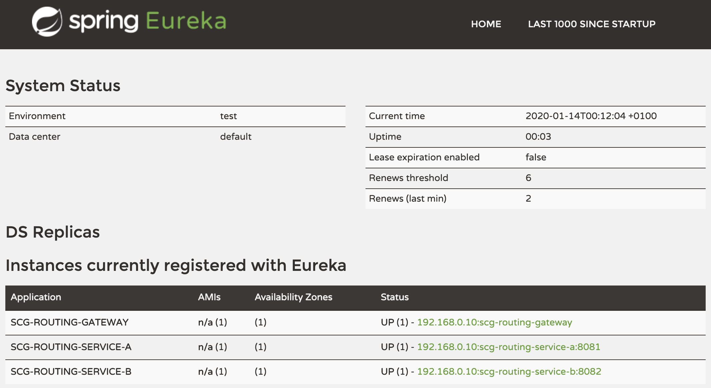

# Routing traffic using Spring Cloud Gateway

This project shows how to dynamically route traffic between 2 microservices using
[Spring Cloud Gateway](https://spring.io/projects/spring-cloud-gateway).

Spring Cloud Gateway allows you to build your own API gateway, just like
a regular Spring Boot app. Gateway config stands with your code, and stays
in sync with your app.

In this demo, we have 2 microservices: service-a and service-b.
Both microservices expose a single endpoint `/hello`.

We also have a Spring Cloud Gateway instance, with a custom filter used to route
traffic between these 2 microservices. Using endpoint `/service` the gateway would send
traffic to the current service. Use `/flip` to change current service.

[](https://asciinema.org/a/kRPX1QImB6ogXegYsVmCSSpJV)

You can run these components on your workstation as regular Java apps,
or you can deploy it to Kubernetes or Pivotal Platform.
No matter which platform you use: you don't need to update the source code.

## How to use it?

Compile this app using a JDK 11+:
```bash
$ ./mvnw clean package
```

When running locally, this app relies on a service registry:
[Netflix Eureka](https://github.com/Netflix/eureka).

Start Eureka:
```bash
$ java -jar eureka/target/scg-routing-eureka.jar
```

Eureka Dashboard is available at http://localhost:8761.

Start the gateway:
```bash
$ java -jar gateway/target/scg-routing-gateway.jar
```

Start service A:
```
$ java -jar service-a/target/scg-routing-service-a.jar
```

Start service B:
```bash
$ java -jar service-b/target/scg-routing-service-b.jar
```

Let's have a look at Eureka Dashboard:
all components have registered with the service registry.



Now hit the gateway start page:
```bash
$ curl localhost:8080
Use these endpoints:
 - http://localhost:8080/service: show current service
 - http://localhost:8080/flip: flip service (from service A to service B and vice-versa)
 - http://localhost:8080/service/hello: call an API from current service
```

This endpoint shows you how to use the available endpoints.

Let's hit service A through the gateway:
```bash
$ curl localhost:8080/service/hello
Hello world
```

Switch to service B:
```bash
$ curl localhost:8080/flip
Service set to B
```

Let's try again:
```bash
$ curl localhost:8080/service/hello
Bonjour le monde
```

## How does it work?

This gateway is made of a custom filter:

```java
@Component
@RequiredArgsConstructor
class CustomRoutingFilter implements GatewayFilter, Ordered {
    private final AppConfig config;
    private final ServiceTargetRepository repo;
    private final Map<ServiceTarget, Route> routes = new HashMap<>(2);

    @PostConstruct
    private void init() {
        // Initialize service routes.
        routes.put(ServiceTarget.A,
                Route.async().id("service-a").uri(config.getServiceA()).predicate(p -> true).build());
        routes.put(ServiceTarget.B,
                Route.async().id("service-b").uri(config.getServiceB()).predicate(p -> true).build());
    }

    @Override
    public Mono<Void> filter(ServerWebExchange exchange, GatewayFilterChain chain) {
        final Route route = routes.get(repo.target);
        // Route input request to the target service using attribute GATEWAY_ROUTE_ATTR,
        // which is read by RouteToRequestUrlFilter to route the request.
        exchange.getAttributes().put(ServerWebExchangeUtils.GATEWAY_ROUTE_ATTR, route);
        return chain.filter(exchange);
    }

    @Override
    public int getOrder() {
        // Filter order is required since we set an attribute which is read by an other filter.
        return RouteToRequestUrlFilter.ROUTE_TO_URL_FILTER_ORDER - 1;
    }
}
```

Depending on current service, this filter sets a `Route` instance
in the current HTTP request, using exchange attribute `GATEWAY_ROUTE_ATTR`.

This key is actually used by filter
[`RouteToRequestUrlFilter`](https://cloud.spring.io/spring-cloud-gateway/reference/html/#the-routetorequesturl-filter)
to redirect an incoming request.

The custom filter is then registered in the Spring Cloud Gateway configuration:

```java
@Configuration
class GatewayConfig {
    @Bean
    RouteLocator routes(RouteLocatorBuilder builder, CustomRoutingFilter filter) {
        return builder.routes()
                .route(r -> r.path("/service/**", "/service")
                        .filters(f -> f
                                // Rewrite the URL part: remove "/service" prefix.
                                .rewritePath("/service/(?<segment>.*)", "/${segment}")
                                .rewritePath("/service", "/")
                                .filter(filter))
                        // "uri" parameter is required, but we cannot use a value here
                        // since we dynamically set the route in the filter.
                        .uri("no://go")
                        .id("service"))
                .build();
    }
}
```

Not only the gateway will redirect traffic to backend services,
but the request URL is also rewritten: `/service` prefix is removed
before the request is sent.

## Deploying to Pivotal Platform

Before you deploy this app to [Pivotal Platform](https://pivotal.io),
you need to rebuild it using a Maven profile which adds
[Spring Cloud Services](https://docs.pivotal.io/spring-cloud-services) support:
```bash
$ ./mvnw clean package -Ppivotal
```

This app relies on a platform managed Eureka server to discover services.
You need to create an Eureka instance:
```bash
$ cf create-service p-service-registry standard service-registry
```

You can then deploy this app:
```bash
$ cf push
```

All components will be bound to the Eureka server.

When all apps are running, you need to allow traffic
betwen the gateway and backend services.
In fact, this app uses
[Container-To-Container networking (C2C)](https://docs.pivotal.io/platform/application-service/concepts/understand-cf-networking.html)
to directly connect app components.
When the gateway sends traffic to a backend service, no external route 
for this service is required: a direct connection will be made between
the two components. Only the gateway is publicly available with a route.

Run these commands to allow traffic between the gateway and backend services:
```bash
$ cf add-network-policy scg-routing-gateway --destination-app scg-routing-service-a
$ cf add-network-policy scg-routing-gateway --destination-app scg-routing-service-b
```

You're done! Hit the gateway route to get access to the services.

## Deploying to Kubernetes

You can also deploy this app to your Kubernetes cluster: the same source code will be used.

Docker images were built using [Cloud-Native Buildpacks](https://buildpacks.io).
Using buildpacks, you can create image containers without having to write a
`Dockerfile`.
See [`pack` CLI documentation](https://buildpacks.io/docs/app-developer-guide/build-an-app/) for more information.

Deploy this app using the Kubernetes manifests:
```bash
$ kubectl apply -f k8s
```

When running in Kubernetes, this app does not rely on Eureka server
to discover app components. The Kubernetes native service discovery and
the native load balancer are used: no need to deploy an Eureka server.

App components are deployed to namespace `scg-routing-demo`:
```bash
$ kubectl -n scg-routing-demo get pods,svc
NAME                             READY   STATUS    RESTARTS   AGE
pod/gateway-6984b8bd5d-hq8nv     1/1     Running   0          88m
pod/service-a-678fb4d7d-klspx    1/1     Running   0          122m
pod/service-b-5f79dffc9c-xkrrt   1/1     Running   0          122m

NAME                TYPE           CLUSTER-IP       EXTERNAL-IP     PORT(S)        AGE
service/gateway     LoadBalancer   10.100.200.205   35.240.113.72   80:31329/TCP   5h36m
service/service-a   ClusterIP      10.100.200.90    <none>          80/TCP         5h36m
service/service-b   ClusterIP      10.100.200.4     <none>          80/TCP         5h36m
```

As you can see, only the gateway is publicly available.
Hit the gateway public IP to reach backend services.

## Contribute

Contributions are always welcome!

Feel free to open issues & send PR.

## License

Copyright &copy; 2020 [VMware, Inc](https://vmware.com).

This project is licensed under the [Apache Software License version 2.0](https://www.apache.org/licenses/LICENSE-2.0).
